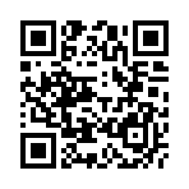

# SSQR

可以解析普通二维码，也可以解析包含 Shadowsocks 服务器信息的 QR Code。



## CLI

SSQR.exe [source] [type] [option]

* source: 来源。
    * `screen`: 屏幕。
    * `filePath`: 文件。
* type: 类型。
    * `qr`: 解析为二维码。
    * `ocr`: 解析为文本（主要针对英文）。
* option: 杂项。
    * `-ss`: 二维码包含 Shadowsocks 服务器信息。
    * `-json`: 以 JSON 格式输出 Shadowsocks 服务器信息。

## Example
```
// 从屏幕截取图片，识别为文本。
$ SSQR.exe screen ocr

// 从屏幕截取二维码并解析。
$ SSQR.exe screen qr

$ SSQR.exe server.png qr
ss://cmM0LW1kNTo4MTY4MTUyNUBzZ2Euc3M4LnNpdGU6MTg2MjEK

$ SSQR.exe server.png qr -ss
address:  sga.ss8.site
port:     18621
method:   rc4-md5
password: 81681525

$ SSQR.exe server.png qr -ss -json
{
  "address": "sga.ss8.site",
  "port": 18621,
  "method": "rc4-md5",
  "password": "81681525"
}
```
